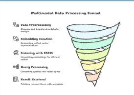
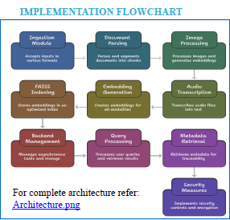
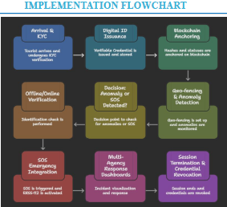

# Smart India Hackathon 2025 — Project Portfolio

---

## Overview

This repository showcases my participation in Smart India Hackathon, where I contributed to ideation, research, and solution presentation for multiple real-world problem statements.

The focus was on designing AI-driven, scalable, and impactful solutions across domains like automation, tourism safety, and multimodal AI systems.

---

# Problem Statement 1  
## Multimodal Offline RAG System

### Problem
Design an offline multimodal Retrieval-Augmented Generation (RAG) system capable of processing text, images, and audio while ensuring privacy and performance without cloud dependency.

---

### Proposed Solution  
**Vault RAG — Secure Multimodal Retrieval (Offline)**

- Unified embeddings for text, image, and audio  
- Offline speech-to-text using Whisper  
- Fast similarity search using FAISS  
- Chat-based retrieval with grounded citations  

---

### System Architecture

---

### Tech Stack

---

### Key Features

- Fully offline AI system  
- Multimodal semantic search  
- Fast retrieval using vector indexing  
- Context-aware answers with citations  
- Privacy-first architecture  

---

### Workflow

---

### Impact

- Enables secure data access in restricted environments  
- Reduces cloud dependency  
- Useful for defense, healthcare, and education  

---

# Problem Statement 2  
## Smart Tourist Safety System

### Problem

Build a system for tourist safety monitoring, incident detection, and secure identity verification using AI, Geo-fencing, and Blockchain.

---

### Proposed Solution  
**AtithiBandhu — Digital Identity & Safety Platform**

- Blockchain-based tourist digital identity  
- AI-powered geofencing and anomaly detection  
- Real-time emergency response  
- Privacy-first architecture  

---

### System Overview

---

### Tech Stack

---

### Key Features

- Blockchain-based digital ID  
- AI-based geofencing alerts  
- Emergency SOS integration  
- Privacy-compliant system  
- Works in low-connectivity areas  

---

### Impact

- Improves tourist safety and trust  
- Enables real-time monitoring  
- Supports scalable government integration  

---

# My Contribution

- Research & problem understanding  
- PPT design and presentation  
- Solution structuring  
- Technical concept framing  

---

# Files

- sih-ps1-presentation.pdf  
- sih-ps2-presentation.pdf  

---

# Note

This repository focuses on idea development and solution design as part of hackathon participation.

---

# Final Thoughts

This experience enhanced my ability to:
- Solve real-world problems  
- Design AI-based systems  
- Communicate technical ideas clearly  

---

⭐ Open to feedback and further development
